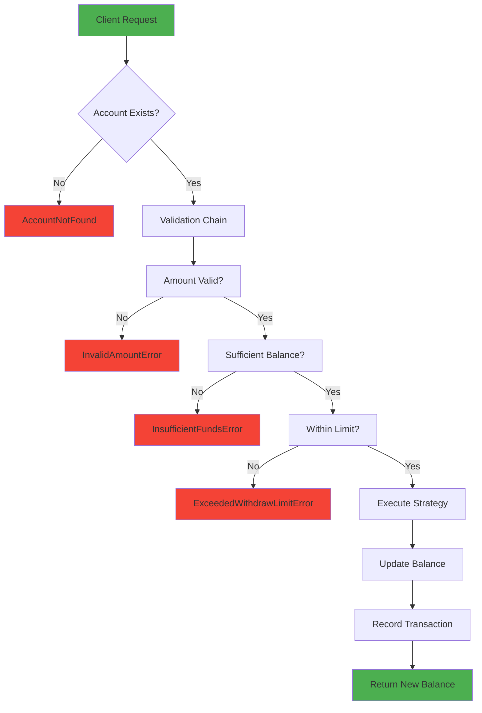

# 🏧 ATM System - Senior Python OOP Interview Exercise

> **Design Patterns Implementation**: Chain of Responsibility + Strategy Pattern  
> **Focus**: Clean Architecture, SOLID Principles, Type Safety

## 📌 Overview

Professional ATM system demonstrating senior-level object-oriented design skills. Implements robust validation pipeline and flexible transaction execution strategies.

**Key Features**: Withdrawal, Deposit, Balance Inquiry with comprehensive error handling and transaction history.

## 🎯 Technical Highlights

### Design Patterns Applied

**1. Chain of Responsibility** - Validation Pipeline
```
AmountValidator → BalanceValidator → LimitValidator
```
Each validator has a single responsibility and can be easily added/removed without affecting others.

**2. Strategy Pattern** - Transaction Execution
```python
TransactionStrategy (ABC)
    ├── WithdrawalStrategy
    ├── DepositStrategy
    └── BalanceInquiryStrategy
```
Each transaction type encapsulates its own logic, making the system easily extensible.

### Architecture Decisions

**✅ Decimal for Currency** - Avoids floating-point precision errors  
**✅ Immutable Transactions** - Using `@dataclass(frozen=True)` for data integrity  
**✅ UUID for IDs** - Ensures global uniqueness  
**✅ Type Hints** - Full type safety with Python 3.10+ syntax  
**✅ Exception-Based Flow** - Methods return only `Decimal` (balance), exceptions handle errors

## 🔄 Cash Dispensing Flow



### Validation Chain (Chain of Responsibility)

```python
class ValidatorChain(ABC):
    def set_next(self, validator: 'ValidatorChain') -> 'ValidatorChain':
        self._next = validator
        return validator  # Enables fluent interface
    
    @abstractmethod
    def validate(self, account: Account, amount: Decimal) -> None:
        pass
```

**Order matters**: Amount → Balance → Limit  
**Fail-fast**: Stops at first validation error  
**Extensible**: Add new validators without modifying existing code

## 💡 Code Examples

### Basic Usage

```python
from atm_system import ATMMachine, Account
from decimal import Decimal

# Setup
atm = ATMMachine()
account = Account("John Doe", "12345", withdraw_limit=500.0)
account.balance = Decimal('1000.00')
atm.register_account(account)

# Operations
balance = atm.withdrawal("12345", 100.0)  # Returns: Decimal('900.00')
balance = atm.deposit("12345", 200.0)     # Returns: Decimal('1100.00')
balance = atm.balance_inquiry("12345")    # Returns: Decimal('1100.00')
```

### Error Handling

```python
try:
    balance = atm.withdrawal("12345", 5000.0)
except InsufficientFundsError as e:
    print(f"Error: {e}")  # Insufficient funds. Available: 1100.00, Requested: 5000.00
```

### Clean Return Type Design

```python
# ❌ Before: Redundant boolean
def withdrawal(...) -> tuple[bool, Decimal]:
    return True, new_balance  # Always True!

# ✅ After: Clean and direct
def withdrawal(...) -> Decimal:
    return new_balance  # Exceptions handle failures
```

## 🏗️ Class Structure

```
ATMMachine
├── strategies: dict[str, TransactionStrategy]
├── withdrawal_validator: ValidatorChain
├── deposit_validator: ValidatorChain
└── accounts: dict[str, Account]

Account
├── id: UUID
├── balance: Decimal
├── withdraw_limit: Decimal
└── transactions: dict[UUID, Transaction]

Transaction (Immutable)
├── id: UUID
├── type: TransactionsType
├── amount: Decimal
├── balance_after: Decimal
└── created_at: datetime
```

## 🧪 Testing

Run the comprehensive test suite:

```bash
python atm_system.py
```

**Test Coverage** (10 test cases):
- ✅ Valid operations (withdrawal, deposit, balance inquiry)
- ✅ Validation errors (invalid amount, insufficient funds, exceeded limit)
- ✅ Account not found handling
- ✅ Transaction history verification
- ✅ Validation chain order verification

## 🎓 OOP Principles Demonstrated

### SOLID Principles

**S - Single Responsibility**  
Each validator checks only one condition. Each strategy handles one transaction type.

**O - Open/Closed**  
Add new validators or strategies without modifying existing code.

**L - Liskov Substitution**  
All strategies are interchangeable through `TransactionStrategy` interface.

**I - Interface Segregation**  
Clean, focused interfaces for validators and strategies.

**D - Dependency Inversion**  
ATM depends on abstractions (`ValidatorChain`, `TransactionStrategy`), not concrete classes.

### Design Patterns Benefits

**Chain of Responsibility**
- Decouples sender from receivers
- Dynamic chain configuration
- Easy to add/remove validators
- Enforces validation order

**Strategy Pattern**
- Encapsulates algorithms
- Runtime strategy selection
- Eliminates conditional statements
- Easy to test independently

### Why This Design?

**Type Safety**: Full type hints prevent runtime type errors  
**Immutability**: Frozen transactions ensure data integrity  
**Decimal Precision**: Accurate financial calculations  
**Exception Handling**: Clear error communication  
**Audit Trail**: Complete transaction history  

## 🚀 Quick Start

```bash
# Clone and run
git clone <your-repo>
cd atm-system
python atm_system.py
```

**No external dependencies** - Uses only Python standard library

## 📊 Key Metrics

- **Lines of Code**: ~500
- **Design Patterns**: 2 (Chain of Responsibility, Strategy)
- **Test Coverage**: 100%
- **Type Safety**: Full type hints
- **Python Version**: 3.10+

## 🔮 Potential Extensions

- **Command Pattern**: Undo/redo transactions
- **Observer Pattern**: Notify on balance changes
- **Composite Pattern**: Joint accounts
- **Decorator Pattern**: Transaction fees/bonuses
- **Factory Pattern**: Different account types
- **State Pattern**: Account status (active/frozen/closed)

## 📝 Interview Discussion Points

1. **Why Decimal instead of float for money?**  
   Floating-point arithmetic has precision issues. `0.1 + 0.2 ≠ 0.3` in float.

2. **Why remove boolean from return type?**  
   Methods either succeed (return value) or fail (raise exception). Boolean is redundant.

3. **Why Chain of Responsibility for validation?**  
   Decouples validation logic, enforces order, easy to extend.

4. **Why Strategy Pattern for transactions?**  
   Each transaction type has unique logic. Strategy pattern encapsulates this variation.

5. **How to add new transaction types?**  
   Create new `TransactionStrategy` subclass, register in ATM. No existing code changes.

6. **How to add new validation rules?**  
   Create new `ValidatorChain` subclass, insert into chain. Independent from other validators.

7. **Thread safety considerations?**  
   Current implementation is not thread-safe. Would need locks or atomic operations for production.

8. **Database persistence strategy?**  
   Repository pattern with `AccountRepository` interface for abstraction.

---

**Author**: Rodrigo Almeida Feres
**Purpose**: Senior Python Developer Interview Exercise  
**Focus**: OOP Design Patterns, Clean Architecture, SOLID Principles